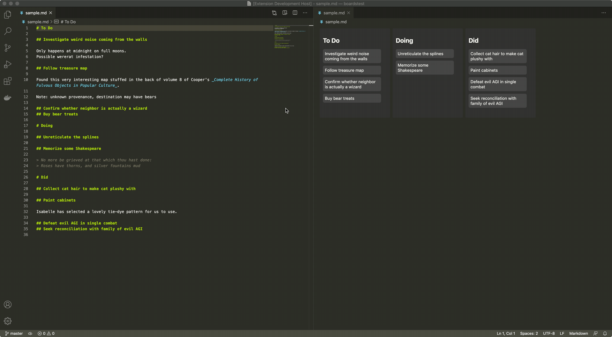

# Mark Headboard

Provides a kanban-board-like view for Markdown files.
Each level 1 heading is a column on the board, and each level 2 heading is a card in the column.

Features:

- clicking a card will take you to that section in the text editor
  - if a column or card title contains links (in the `[title](href)` syntax), command-clicking it instead opens the first link
- drag & drop cards or columns to rearrange sections in the document

## Usage

Two commands are added to the command palette:

- `Mark Headboard: Reopen as Board`
- `Mark Headboard: Open as Board to the Side`

Or, you can use `Reopen Editor With`.

## Known Issues

Markdown parsing is primitive and done via regex.
Most notably, it doesn't yet know to ignore fenced code blocks when scanning for headings.
Also, only atx-style headers (`#` and `##`) are supported, not setext-style headers.

Moving the last column to the front does not work correctly if there is no trailing newline.
